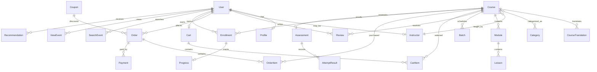

# UpSkillIN Architecture

## System

An npm-workspaces monorepo with a Next.js App Router storefront (`apps/web`) and
a NestJS REST API (`apps/api`). The API owns validation, RBAC, catalog and
transaction rules; Prisma maps PostgreSQL. Redis is reserved for OTP/session
rate limits and cache. The web app consumes documented API endpoints and is
PWA-ready. Search starts with PostgreSQL full-text search. Razorpay is an
optional test-mode adapter; local development uses a clearly marked simulated
payment provider and never treats a browser redirect as payment confirmation.
Localized UI and course metadata are separate.

The Prisma schema is the canonical relational contract. Transaction-sensitive
actions (checkout, payment verification, enrollment) are API-only. Audit and
consent records accompany user-sensitive actions; PII encryption keys and
provider credentials are environment-managed.

## Delivery breakdown

1. **Foundation** — workspace, shared types/config, API health/OpenAPI,
   PostgreSQL/Redis Compose, Prisma schema, environment template and seed.
2. **Identity** — OTP/Google-ready auth boundary, learner profile, roles,
   consent, validation, rate limiting and auth tests.
3. **Discovery** — catalog, search, URL-driven combinable filters, sorting,
   result counts, localized detail pages and verified reviews.
4. **Commerce** — persistent/mergeable cart, batches/coupons, GST calculation,
   checkout validation, idempotent orders and payment/webhook boundary.
5. **Learning** — order confirmation/invoice hook, enrollments, progress,
   attendance/assessment, certificates and recommendations/events.
6. **Operations** — instructor/admin course tools, moderation, observability,
   accessibility, PWA, CI, E2E and setup/demo documentation.

Each slice should be committed with focused unit, API integration, and browser
coverage. In this fresh workspace there is not yet a Git repository; delivery
commits will be recorded after initializing one.
